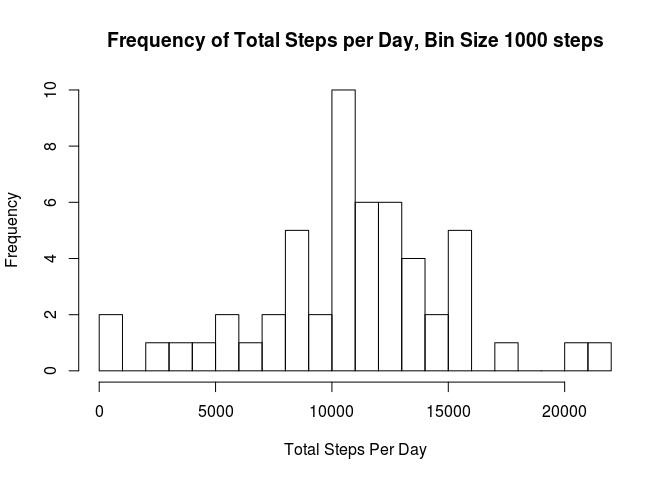
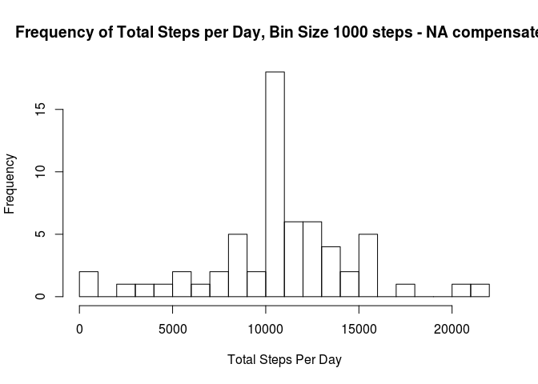

## Loading and preprocessing the data
### Loading

```r
dat = read.csv("activity.csv", header = TRUE)
nasidx = which(!complete.cases(dat[,1 ]))
nasdays = dat[nasidx,2]
summary(nasdays)
```

```
## 2012-10-01 2012-10-02 2012-10-03 2012-10-04 2012-10-05 2012-10-06 
##        288          0          0          0          0          0 
## 2012-10-07 2012-10-08 2012-10-09 2012-10-10 2012-10-11 2012-10-12 
##          0        288          0          0          0          0 
## 2012-10-13 2012-10-14 2012-10-15 2012-10-16 2012-10-17 2012-10-18 
##          0          0          0          0          0          0 
## 2012-10-19 2012-10-20 2012-10-21 2012-10-22 2012-10-23 2012-10-24 
##          0          0          0          0          0          0 
## 2012-10-25 2012-10-26 2012-10-27 2012-10-28 2012-10-29 2012-10-30 
##          0          0          0          0          0          0 
## 2012-10-31 2012-11-01 2012-11-02 2012-11-03 2012-11-04 2012-11-05 
##          0        288          0          0        288          0 
## 2012-11-06 2012-11-07 2012-11-08 2012-11-09 2012-11-10 2012-11-11 
##          0          0          0        288        288          0 
## 2012-11-12 2012-11-13 2012-11-14 2012-11-15 2012-11-16 2012-11-17 
##          0          0        288          0          0          0 
## 2012-11-18 2012-11-19 2012-11-20 2012-11-21 2012-11-22 2012-11-23 
##          0          0          0          0          0          0 
## 2012-11-24 2012-11-25 2012-11-26 2012-11-27 2012-11-28 2012-11-29 
##          0          0          0          0          0          0 
## 2012-11-30 
##        288
```
### Processing
From the summary of the NA values, it is clear that NAs are simply days during which no data were collected.  
Adding a columun with the weekday names

```r
dat[, 4] = weekdays(as.Date(dat[, 2]))
 colnames(dat)[4] <- "weekdays"
```
## Mean total number of steps taken per day
### Steps Per Day

```r
library(dplyr)
TotStepsEachDay = group_by(dat, date) %>% summarize(steps_per_day = sum(steps))
hist(TotStepsEachDay$steps_per_day, 25, main = "Frequency of Total Steps per Day, Bin Size 1000 steps", xlab = "Total Steps Per Day")
```

<!-- -->
  
### Mean and Median of Total Steps Per Day

```r
summary(TotStepsEachDay)
```

```
##          date    steps_per_day  
##  2012-10-01: 1   Min.   :   41  
##  2012-10-02: 1   1st Qu.: 8841  
##  2012-10-03: 1   Median :10765  
##  2012-10-04: 1   Mean   :10766  
##  2012-10-05: 1   3rd Qu.:13294  
##  2012-10-06: 1   Max.   :21194  
##  (Other)   :55   NA's   :8
```

### What is the average daily activity pattern?

```r
library(plotly)
clean_dat = dat[which(complete.cases(dat[,1 ])), ]
missing_dat = dat[which(!complete.cases(dat[,1 ])), ]
tm <- seq(0, 299*288, by = 300)
now <- as.Date(clean_dat[1, 2])
now <- as.POSIXct(now)
now <- now-(9*60*60)
x <- now+tm
five_min_avg = group_by(clean_dat, interval) %>% summarize(five_min_mean = mean(steps))
y <- unlist(five_min_avg[ ,2], use.names = FALSE)
p <- plot_ly(x = ~x, y = ~y, mode = 'lines')
ax <- list(title = "Average daily activity Oct 2nd - Nov 29th 2012")
ay <- list(title = "5 Min Interval Steps")
layout(p, xaxis= ax, yaxis = ay)
```

<!--html_preserve--><div id="4889785ee9c7" style="width:672px;height:480px;" class="plotly html-widget"></div>
<script type="application/json" data-for="4889785ee9c7">{"x":{"visdat":{"488946cdf0f0":["function () ","plotlyVisDat"]},"cur_data":"488946cdf0f0","attrs":{"488946cdf0f0":{"x":{},"y":{},"mode":"lines","alpha":1,"sizes":[10,100]}},"layout":{"margin":{"b":40,"l":60,"t":25,"r":10},"xaxis":{"domain":[0,1],"title":"Average daily activity Oct 2nd - Nov 29th 2012"},"yaxis":{"domain":[0,1],"title":"5 Min Interval Steps"},"hovermode":"closest","showlegend":false},"source":"A","config":{"modeBarButtonsToAdd":[{"name":"Collaborate","icon":{"width":1000,"ascent":500,"descent":-50,"path":"M487 375c7-10 9-23 5-36l-79-259c-3-12-11-23-22-31-11-8-22-12-35-12l-263 0c-15 0-29 5-43 15-13 10-23 23-28 37-5 13-5 25-1 37 0 0 0 3 1 7 1 5 1 8 1 11 0 2 0 4-1 6 0 3-1 5-1 6 1 2 2 4 3 6 1 2 2 4 4 6 2 3 4 5 5 7 5 7 9 16 13 26 4 10 7 19 9 26 0 2 0 5 0 9-1 4-1 6 0 8 0 2 2 5 4 8 3 3 5 5 5 7 4 6 8 15 12 26 4 11 7 19 7 26 1 1 0 4 0 9-1 4-1 7 0 8 1 2 3 5 6 8 4 4 6 6 6 7 4 5 8 13 13 24 4 11 7 20 7 28 1 1 0 4 0 7-1 3-1 6-1 7 0 2 1 4 3 6 1 1 3 4 5 6 2 3 3 5 5 6 1 2 3 5 4 9 2 3 3 7 5 10 1 3 2 6 4 10 2 4 4 7 6 9 2 3 4 5 7 7 3 2 7 3 11 3 3 0 8 0 13-1l0-1c7 2 12 2 14 2l218 0c14 0 25-5 32-16 8-10 10-23 6-37l-79-259c-7-22-13-37-20-43-7-7-19-10-37-10l-248 0c-5 0-9-2-11-5-2-3-2-7 0-12 4-13 18-20 41-20l264 0c5 0 10 2 16 5 5 3 8 6 10 11l85 282c2 5 2 10 2 17 7-3 13-7 17-13z m-304 0c-1-3-1-5 0-7 1-1 3-2 6-2l174 0c2 0 4 1 7 2 2 2 4 4 5 7l6 18c0 3 0 5-1 7-1 1-3 2-6 2l-173 0c-3 0-5-1-8-2-2-2-4-4-4-7z m-24-73c-1-3-1-5 0-7 2-2 3-2 6-2l174 0c2 0 5 0 7 2 3 2 4 4 5 7l6 18c1 2 0 5-1 6-1 2-3 3-5 3l-174 0c-3 0-5-1-7-3-3-1-4-4-5-6z"},"click":"function(gd) { \n        // is this being viewed in RStudio?\n        if (location.search == '?viewer_pane=1') {\n          alert('To learn about plotly for collaboration, visit:\\n https://cpsievert.github.io/plotly_book/plot-ly-for-collaboration.html');\n        } else {\n          window.open('https://cpsievert.github.io/plotly_book/plot-ly-for-collaboration.html', '_blank');\n        }\n      }"}],"cloud":false},"data":[{"x":["2012-10-02 00:00:00","2012-10-02 00:05:00","2012-10-02 00:10:00","2012-10-02 00:15:00","2012-10-02 00:20:00","2012-10-02 00:25:00","2012-10-02 00:30:00","2012-10-02 00:35:00","2012-10-02 00:40:00","2012-10-02 00:45:00","2012-10-02 00:50:00","2012-10-02 00:55:00","2012-10-02 01:00:00","2012-10-02 01:05:00","2012-10-02 01:10:00","2012-10-02 01:15:00","2012-10-02 01:20:00","2012-10-02 01:25:00","2012-10-02 01:30:00","2012-10-02 01:35:00","2012-10-02 01:40:00","2012-10-02 01:45:00","2012-10-02 01:50:00","2012-10-02 01:55:00","2012-10-02 02:00:00","2012-10-02 02:05:00","2012-10-02 02:10:00","2012-10-02 02:15:00","2012-10-02 02:20:00","2012-10-02 02:25:00","2012-10-02 02:30:00","2012-10-02 02:35:00","2012-10-02 02:40:00","2012-10-02 02:45:00","2012-10-02 02:50:00","2012-10-02 02:55:00","2012-10-02 03:00:00","2012-10-02 03:05:00","2012-10-02 03:10:00","2012-10-02 03:15:00","2012-10-02 03:20:00","2012-10-02 03:25:00","2012-10-02 03:30:00","2012-10-02 03:35:00","2012-10-02 03:40:00","2012-10-02 03:45:00","2012-10-02 03:50:00","2012-10-02 03:55:00","2012-10-02 04:00:00","2012-10-02 04:05:00","2012-10-02 04:10:00","2012-10-02 04:15:00","2012-10-02 04:20:00","2012-10-02 04:25:00","2012-10-02 04:30:00","2012-10-02 04:35:00","2012-10-02 04:40:00","2012-10-02 04:45:00","2012-10-02 04:50:00","2012-10-02 04:55:00","2012-10-02 05:00:00","2012-10-02 05:05:00","2012-10-02 05:10:00","2012-10-02 05:15:00","2012-10-02 05:20:00","2012-10-02 05:25:00","2012-10-02 05:30:00","2012-10-02 05:35:00","2012-10-02 05:40:00","2012-10-02 05:45:00","2012-10-02 05:50:00","2012-10-02 05:55:00","2012-10-02 06:00:00","2012-10-02 06:05:00","2012-10-02 06:10:00","2012-10-02 06:15:00","2012-10-02 06:20:00","2012-10-02 06:25:00","2012-10-02 06:30:00","2012-10-02 06:35:00","2012-10-02 06:40:00","2012-10-02 06:45:00","2012-10-02 06:50:00","2012-10-02 06:55:00","2012-10-02 07:00:00","2012-10-02 07:05:00","2012-10-02 07:10:00","2012-10-02 07:15:00","2012-10-02 07:20:00","2012-10-02 07:25:00","2012-10-02 07:30:00","2012-10-02 07:35:00","2012-10-02 07:40:00","2012-10-02 07:45:00","2012-10-02 07:50:00","2012-10-02 07:55:00","2012-10-02 08:00:00","2012-10-02 08:05:00","2012-10-02 08:10:00","2012-10-02 08:15:00","2012-10-02 08:20:00","2012-10-02 08:25:00","2012-10-02 08:30:00","2012-10-02 08:35:00","2012-10-02 08:40:00","2012-10-02 08:45:00","2012-10-02 08:50:00","2012-10-02 08:55:00","2012-10-02 09:00:00","2012-10-02 09:05:00","2012-10-02 09:10:00","2012-10-02 09:15:00","2012-10-02 09:20:00","2012-10-02 09:25:00","2012-10-02 09:30:00","2012-10-02 09:35:00","2012-10-02 09:40:00","2012-10-02 09:45:00","2012-10-02 09:50:00","2012-10-02 09:55:00","2012-10-02 10:00:00","2012-10-02 10:05:00","2012-10-02 10:10:00","2012-10-02 10:15:00","2012-10-02 10:20:00","2012-10-02 10:25:00","2012-10-02 10:30:00","2012-10-02 10:35:00","2012-10-02 10:40:00","2012-10-02 10:45:00","2012-10-02 10:50:00","2012-10-02 10:55:00","2012-10-02 11:00:00","2012-10-02 11:05:00","2012-10-02 11:10:00","2012-10-02 11:15:00","2012-10-02 11:20:00","2012-10-02 11:25:00","2012-10-02 11:30:00","2012-10-02 11:35:00","2012-10-02 11:40:00","2012-10-02 11:45:00","2012-10-02 11:50:00","2012-10-02 11:55:00","2012-10-02 12:00:00","2012-10-02 12:05:00","2012-10-02 12:10:00","2012-10-02 12:15:00","2012-10-02 12:20:00","2012-10-02 12:25:00","2012-10-02 12:30:00","2012-10-02 12:35:00","2012-10-02 12:40:00","2012-10-02 12:45:00","2012-10-02 12:50:00","2012-10-02 12:55:00","2012-10-02 13:00:00","2012-10-02 13:05:00","2012-10-02 13:10:00","2012-10-02 13:15:00","2012-10-02 13:20:00","2012-10-02 13:25:00","2012-10-02 13:30:00","2012-10-02 13:35:00","2012-10-02 13:40:00","2012-10-02 13:45:00","2012-10-02 13:50:00","2012-10-02 13:55:00","2012-10-02 14:00:00","2012-10-02 14:05:00","2012-10-02 14:10:00","2012-10-02 14:15:00","2012-10-02 14:20:00","2012-10-02 14:25:00","2012-10-02 14:30:00","2012-10-02 14:35:00","2012-10-02 14:40:00","2012-10-02 14:45:00","2012-10-02 14:50:00","2012-10-02 14:55:00","2012-10-02 15:00:00","2012-10-02 15:05:00","2012-10-02 15:10:00","2012-10-02 15:15:00","2012-10-02 15:20:00","2012-10-02 15:25:00","2012-10-02 15:30:00","2012-10-02 15:35:00","2012-10-02 15:40:00","2012-10-02 15:45:00","2012-10-02 15:50:00","2012-10-02 15:55:00","2012-10-02 16:00:00","2012-10-02 16:05:00","2012-10-02 16:10:00","2012-10-02 16:15:00","2012-10-02 16:20:00","2012-10-02 16:25:00","2012-10-02 16:30:00","2012-10-02 16:35:00","2012-10-02 16:40:00","2012-10-02 16:45:00","2012-10-02 16:50:00","2012-10-02 16:55:00","2012-10-02 17:00:00","2012-10-02 17:05:00","2012-10-02 17:10:00","2012-10-02 17:15:00","2012-10-02 17:20:00","2012-10-02 17:25:00","2012-10-02 17:30:00","2012-10-02 17:35:00","2012-10-02 17:40:00","2012-10-02 17:45:00","2012-10-02 17:50:00","2012-10-02 17:55:00","2012-10-02 18:00:00","2012-10-02 18:05:00","2012-10-02 18:10:00","2012-10-02 18:15:00","2012-10-02 18:20:00","2012-10-02 18:25:00","2012-10-02 18:30:00","2012-10-02 18:35:00","2012-10-02 18:40:00","2012-10-02 18:45:00","2012-10-02 18:50:00","2012-10-02 18:55:00","2012-10-02 19:00:00","2012-10-02 19:05:00","2012-10-02 19:10:00","2012-10-02 19:15:00","2012-10-02 19:20:00","2012-10-02 19:25:00","2012-10-02 19:30:00","2012-10-02 19:35:00","2012-10-02 19:40:00","2012-10-02 19:45:00","2012-10-02 19:50:00","2012-10-02 19:55:00","2012-10-02 20:00:00","2012-10-02 20:05:00","2012-10-02 20:10:00","2012-10-02 20:15:00","2012-10-02 20:20:00","2012-10-02 20:25:00","2012-10-02 20:30:00","2012-10-02 20:35:00","2012-10-02 20:40:00","2012-10-02 20:45:00","2012-10-02 20:50:00","2012-10-02 20:55:00","2012-10-02 21:00:00","2012-10-02 21:05:00","2012-10-02 21:10:00","2012-10-02 21:15:00","2012-10-02 21:20:00","2012-10-02 21:25:00","2012-10-02 21:30:00","2012-10-02 21:35:00","2012-10-02 21:40:00","2012-10-02 21:45:00","2012-10-02 21:50:00","2012-10-02 21:55:00","2012-10-02 22:00:00","2012-10-02 22:05:00","2012-10-02 22:10:00","2012-10-02 22:15:00","2012-10-02 22:20:00","2012-10-02 22:25:00","2012-10-02 22:30:00","2012-10-02 22:35:00","2012-10-02 22:40:00","2012-10-02 22:45:00","2012-10-02 22:50:00","2012-10-02 22:55:00","2012-10-02 23:00:00","2012-10-02 23:05:00","2012-10-02 23:10:00","2012-10-02 23:15:00","2012-10-02 23:20:00","2012-10-02 23:25:00","2012-10-02 23:30:00","2012-10-02 23:35:00","2012-10-02 23:40:00","2012-10-02 23:45:00","2012-10-02 23:50:00","2012-10-02 23:55:00"],"y":[1.71698113207547,0.339622641509434,0.132075471698113,0.150943396226415,0.0754716981132075,2.09433962264151,0.528301886792453,0.867924528301887,0,1.47169811320755,0.30188679245283,0.132075471698113,0.320754716981132,0.679245283018868,0.150943396226415,0.339622641509434,0,1.11320754716981,1.83018867924528,0.169811320754717,0.169811320754717,0.377358490566038,0.264150943396226,0,0,0,1.13207547169811,0,0,0.132075471698113,0,0.226415094339623,0,0,1.54716981132075,0.943396226415094,0,0,0,0,0.207547169811321,0.622641509433962,1.62264150943396,0.584905660377358,0.490566037735849,0.0754716981132075,0,0,1.18867924528302,0.943396226415094,2.56603773584906,0,0.339622641509434,0.358490566037736,4.11320754716981,0.660377358490566,3.49056603773585,0.830188679245283,3.11320754716981,1.11320754716981,0,1.56603773584906,3,2.24528301886792,3.32075471698113,2.9622641509434,2.09433962264151,6.05660377358491,16.0188679245283,18.3396226415094,39.4528301886792,44.4905660377358,31.4905660377358,49.2641509433962,53.7735849056604,63.4528301886792,49.9622641509434,47.0754716981132,52.1509433962264,39.3396226415094,44.0188679245283,44.1698113207547,37.3584905660377,49.0377358490566,43.811320754717,44.377358490566,50.5094339622642,54.5094339622642,49.9245283018868,50.9811320754717,55.6792452830189,44.3207547169811,52.2641509433962,69.5471698113208,57.8490566037736,56.1509433962264,73.377358490566,68.2075471698113,129.433962264151,157.528301886792,171.150943396226,155.396226415094,177.301886792453,206.169811320755,195.924528301887,179.566037735849,183.396226415094,167.018867924528,143.452830188679,124.037735849057,109.11320754717,108.11320754717,103.716981132075,95.9622641509434,66.2075471698113,45.2264150943396,24.7924528301887,38.7547169811321,34.9811320754717,21.0566037735849,40.5660377358491,26.9811320754717,42.4150943396226,52.6603773584906,38.9245283018868,50.7924528301887,44.2830188679245,37.4150943396226,34.6981132075472,28.3396226415094,25.0943396226415,31.9433962264151,31.3584905660377,29.6792452830189,21.3207547169811,25.5471698113208,28.377358490566,26.4716981132075,33.4339622641509,49.9811320754717,42.0377358490566,44.6037735849057,46.0377358490566,59.188679245283,63.8679245283019,87.6981132075472,94.8490566037736,92.7735849056604,63.3962264150943,50.1698113207547,54.4716981132075,32.4150943396226,26.5283018867925,37.7358490566038,45.0566037735849,67.2830188679245,42.3396226415094,39.8867924528302,43.2641509433962,40.9811320754717,46.2452830188679,56.4339622641509,42.7547169811321,25.1320754716981,39.9622641509434,53.5471698113208,47.3207547169811,60.811320754717,55.7547169811321,51.9622641509434,43.5849056603774,48.6981132075472,35.4716981132075,37.5471698113208,41.8490566037736,27.5094339622642,17.1132075471698,26.0754716981132,43.622641509434,43.7735849056604,30.0188679245283,36.0754716981132,35.4905660377358,38.8490566037736,45.9622641509434,47.7547169811321,48.1320754716981,65.3207547169811,82.9056603773585,98.6603773584906,102.11320754717,83.9622641509434,62.1320754716981,64.1320754716981,74.5471698113208,63.1698113207547,56.9056603773585,59.7735849056604,43.8679245283019,38.5660377358491,44.6603773584906,45.4528301886792,46.2075471698113,43.6792452830189,46.622641509434,56.3018867924528,50.7169811320755,61.2264150943396,72.7169811320755,78.9433962264151,68.9433962264151,59.6603773584906,75.0943396226415,56.5094339622642,34.7735849056604,37.4528301886792,40.6792452830189,58.0188679245283,74.6981132075472,85.3207547169811,59.2641509433962,67.7735849056604,77.6981132075472,74.2452830188679,85.3396226415094,99.4528301886792,86.5849056603774,85.6037735849057,84.8679245283019,77.8301886792453,58.0377358490566,53.3584905660377,36.3207547169811,20.7169811320755,27.3962264150943,40.0188679245283,30.2075471698113,25.5471698113208,45.6603773584906,33.5283018867925,19.622641509434,19.0188679245283,19.3396226415094,33.3396226415094,26.811320754717,21.1698113207547,27.3018867924528,21.3396226415094,19.5471698113208,21.3207547169811,32.3018867924528,20.1509433962264,15.9433962264151,17.2264150943396,23.4528301886792,19.2452830188679,12.4528301886792,8.0188679245283,14.6603773584906,16.3018867924528,8.67924528301887,7.79245283018868,8.13207547169811,2.62264150943396,1.45283018867925,3.67924528301887,4.81132075471698,8.50943396226415,7.07547169811321,8.69811320754717,9.75471698113208,2.20754716981132,0.320754716981132,0.113207547169811,1.60377358490566,4.60377358490566,3.30188679245283,2.84905660377358,0,0.830188679245283,0.962264150943396,1.58490566037736,2.60377358490566,4.69811320754717,3.30188679245283,0.641509433962264,0.226415094339623,1.07547169811321],"mode":"lines","type":"scatter","line":{"fillcolor":"rgba(31,119,180,1)","color":"rgba(31,119,180,1)"},"xaxis":"x","yaxis":"y","frame":null}],"highlight":{"on":"plotly_click","persistent":false,"dynamic":false,"selectize":false,"opacityDim":0.2,"selected":{"opacity":1}},"base_url":"https://plot.ly"},"evals":["config.modeBarButtonsToAdd.0.click"],"jsHooks":{"render":[{"code":"function(el, x) { var ctConfig = crosstalk.var('plotlyCrosstalkOpts').set({\"on\":\"plotly_click\",\"persistent\":false,\"dynamic\":false,\"selectize\":false,\"opacityDim\":0.2,\"selected\":{\"opacity\":1}}); }","data":null}]}}</script><!--/html_preserve-->

Time interval  with largest average numbe of step

```r
five_min_avg[which(y==max(y)), 1]
```

```
## # A tibble: 1 x 1
##   interval
##      <int>
## 1      835
```
### Imputing missing values
Total number of raws with a missing value

```r
length(which(!complete.cases(dat[,1 ])))
```

```
## [1] 2304
```
From the pre-processing phase of the analsys, we know the missing values correspond to whole days, when no data were collected.
A simple strategy to imputing the missing data is simply replacing the missing days with the average activty day. 
However, it might be useful to verify if the missing days display some other property that could be used to more accurately imput the missing data.   
An easy way to do this is by checking what days of the week are missing. If for instance only Mondays were missing, and Mondays were to have much less steps than other days of the week, it would be more accurate to replace the missing data, with the average of the avaibale data collected on Mondays, rather than any other day.  
Days where data are missing:

```r
 levels(factor(clean_dat$weekdays))
```

```
## [1] "Friday"    "Monday"    "Saturday"  "Sunday"    "Thursday"  "Tuesday"  
## [7] "Wednesday"
```

Every single day of the week is inlcuded in the 8 days of missing data, indicating that there is no particular pattern linked with the missing data days, therefore we will simply replace them with the average day steps distribution shown above. 

```r
for (i in seq(from=0, to=288*8-1, by=1)) {
     missing_dat[1+i, 1] = five_min_avg[1+i%%288, 2]
     }
full_dat = bind_rows(missing_dat, clean_dat)
TotStepsEachDay = group_by(full_dat, date) %>% summarize(steps_per_day = sum(steps))
hist(TotStepsEachDay$steps_per_day, 25, main = "Frequency of Total Steps per Day, Bin Size 1000 steps - NA compensated", xlab = "Total Steps Per Day")
```

<!-- -->

## Are there differences in activity patterns between weekdays and weekends?

```r
# Separate Weekdays from Weekend days
weekends = full_dat[full_dat$weekdays == "Sunday" | full_dat$weekdays == "Saturday" , ]
week = full_dat[full_dat$weekdays != "Sunday" & full_dat$weekdays != "Saturday" , ]

# weekdays and weekend means plots

five_min_avg_wkend = group_by(weekends, interval) %>% summarize(five_min_mean = mean(steps))
y1 <- unlist(five_min_avg_wkend[ ,2], use.names = FALSE)
five_min_avg_wk = group_by(week, interval) %>% summarize(five_min_mean = mean(steps))
y2 <- unlist(five_min_avg_wk[ ,2], use.names = FALSE)

ax1 <- list(title = "Average daily activity Oct 2nd - Nov 29th 2012 WEEKENDS vs WEEKDAYS")
ay1 <- list(title = "5 Min Interval Steps")
data <- data.frame(x, y1, y2)

p <- plot_ly(data, x = ~x, y = ~y1, name = 'Week ends', type = 'scatter', mode = 'lines') %>%
  add_trace(y = ~y2, name = 'Weekdays', mode = 'lines')
layout(p, xaxis= ax1, yaxis = ay1)
```

<!--html_preserve--><div id="488918e9e014" style="width:672px;height:480px;" class="plotly html-widget"></div>
<script type="application/json" data-for="488918e9e014">{"x":{"visdat":{"488960c3464c":["function () ","plotlyVisDat"]},"cur_data":"488960c3464c","attrs":{"488960c3464c":{"x":{},"y":{},"name":"Week ends","mode":"lines","alpha":1,"sizes":[10,100],"type":"scatter"},"488960c3464c.1":{"x":{},"y":{},"name":"Weekdays","mode":"lines","alpha":1,"sizes":[10,100],"type":"scatter"}},"layout":{"margin":{"b":40,"l":60,"t":25,"r":10},"xaxis":{"domain":[0,1],"title":"Average daily activity Oct 2nd - Nov 29th 2012 WEEKENDS vs WEEKDAYS"},"yaxis":{"domain":[0,1],"title":"5 Min Interval Steps"},"hovermode":"closest","showlegend":true},"source":"A","config":{"modeBarButtonsToAdd":[{"name":"Collaborate","icon":{"width":1000,"ascent":500,"descent":-50,"path":"M487 375c7-10 9-23 5-36l-79-259c-3-12-11-23-22-31-11-8-22-12-35-12l-263 0c-15 0-29 5-43 15-13 10-23 23-28 37-5 13-5 25-1 37 0 0 0 3 1 7 1 5 1 8 1 11 0 2 0 4-1 6 0 3-1 5-1 6 1 2 2 4 3 6 1 2 2 4 4 6 2 3 4 5 5 7 5 7 9 16 13 26 4 10 7 19 9 26 0 2 0 5 0 9-1 4-1 6 0 8 0 2 2 5 4 8 3 3 5 5 5 7 4 6 8 15 12 26 4 11 7 19 7 26 1 1 0 4 0 9-1 4-1 7 0 8 1 2 3 5 6 8 4 4 6 6 6 7 4 5 8 13 13 24 4 11 7 20 7 28 1 1 0 4 0 7-1 3-1 6-1 7 0 2 1 4 3 6 1 1 3 4 5 6 2 3 3 5 5 6 1 2 3 5 4 9 2 3 3 7 5 10 1 3 2 6 4 10 2 4 4 7 6 9 2 3 4 5 7 7 3 2 7 3 11 3 3 0 8 0 13-1l0-1c7 2 12 2 14 2l218 0c14 0 25-5 32-16 8-10 10-23 6-37l-79-259c-7-22-13-37-20-43-7-7-19-10-37-10l-248 0c-5 0-9-2-11-5-2-3-2-7 0-12 4-13 18-20 41-20l264 0c5 0 10 2 16 5 5 3 8 6 10 11l85 282c2 5 2 10 2 17 7-3 13-7 17-13z m-304 0c-1-3-1-5 0-7 1-1 3-2 6-2l174 0c2 0 4 1 7 2 2 2 4 4 5 7l6 18c0 3 0 5-1 7-1 1-3 2-6 2l-173 0c-3 0-5-1-8-2-2-2-4-4-4-7z m-24-73c-1-3-1-5 0-7 2-2 3-2 6-2l174 0c2 0 5 0 7 2 3 2 4 4 5 7l6 18c1 2 0 5-1 6-1 2-3 3-5 3l-174 0c-3 0-5-1-7-3-3-1-4-4-5-6z"},"click":"function(gd) { \n        // is this being viewed in RStudio?\n        if (location.search == '?viewer_pane=1') {\n          alert('To learn about plotly for collaboration, visit:\\n https://cpsievert.github.io/plotly_book/plot-ly-for-collaboration.html');\n        } else {\n          window.open('https://cpsievert.github.io/plotly_book/plot-ly-for-collaboration.html', '_blank');\n        }\n      }"}],"cloud":false},"data":[{"x":["2012-10-02 00:00:00","2012-10-02 00:05:00","2012-10-02 00:10:00","2012-10-02 00:15:00","2012-10-02 00:20:00","2012-10-02 00:25:00","2012-10-02 00:30:00","2012-10-02 00:35:00","2012-10-02 00:40:00","2012-10-02 00:45:00","2012-10-02 00:50:00","2012-10-02 00:55:00","2012-10-02 01:00:00","2012-10-02 01:05:00","2012-10-02 01:10:00","2012-10-02 01:15:00","2012-10-02 01:20:00","2012-10-02 01:25:00","2012-10-02 01:30:00","2012-10-02 01:35:00","2012-10-02 01:40:00","2012-10-02 01:45:00","2012-10-02 01:50:00","2012-10-02 01:55:00","2012-10-02 02:00:00","2012-10-02 02:05:00","2012-10-02 02:10:00","2012-10-02 02:15:00","2012-10-02 02:20:00","2012-10-02 02:25:00","2012-10-02 02:30:00","2012-10-02 02:35:00","2012-10-02 02:40:00","2012-10-02 02:45:00","2012-10-02 02:50:00","2012-10-02 02:55:00","2012-10-02 03:00:00","2012-10-02 03:05:00","2012-10-02 03:10:00","2012-10-02 03:15:00","2012-10-02 03:20:00","2012-10-02 03:25:00","2012-10-02 03:30:00","2012-10-02 03:35:00","2012-10-02 03:40:00","2012-10-02 03:45:00","2012-10-02 03:50:00","2012-10-02 03:55:00","2012-10-02 04:00:00","2012-10-02 04:05:00","2012-10-02 04:10:00","2012-10-02 04:15:00","2012-10-02 04:20:00","2012-10-02 04:25:00","2012-10-02 04:30:00","2012-10-02 04:35:00","2012-10-02 04:40:00","2012-10-02 04:45:00","2012-10-02 04:50:00","2012-10-02 04:55:00","2012-10-02 05:00:00","2012-10-02 05:05:00","2012-10-02 05:10:00","2012-10-02 05:15:00","2012-10-02 05:20:00","2012-10-02 05:25:00","2012-10-02 05:30:00","2012-10-02 05:35:00","2012-10-02 05:40:00","2012-10-02 05:45:00","2012-10-02 05:50:00","2012-10-02 05:55:00","2012-10-02 06:00:00","2012-10-02 06:05:00","2012-10-02 06:10:00","2012-10-02 06:15:00","2012-10-02 06:20:00","2012-10-02 06:25:00","2012-10-02 06:30:00","2012-10-02 06:35:00","2012-10-02 06:40:00","2012-10-02 06:45:00","2012-10-02 06:50:00","2012-10-02 06:55:00","2012-10-02 07:00:00","2012-10-02 07:05:00","2012-10-02 07:10:00","2012-10-02 07:15:00","2012-10-02 07:20:00","2012-10-02 07:25:00","2012-10-02 07:30:00","2012-10-02 07:35:00","2012-10-02 07:40:00","2012-10-02 07:45:00","2012-10-02 07:50:00","2012-10-02 07:55:00","2012-10-02 08:00:00","2012-10-02 08:05:00","2012-10-02 08:10:00","2012-10-02 08:15:00","2012-10-02 08:20:00","2012-10-02 08:25:00","2012-10-02 08:30:00","2012-10-02 08:35:00","2012-10-02 08:40:00","2012-10-02 08:45:00","2012-10-02 08:50:00","2012-10-02 08:55:00","2012-10-02 09:00:00","2012-10-02 09:05:00","2012-10-02 09:10:00","2012-10-02 09:15:00","2012-10-02 09:20:00","2012-10-02 09:25:00","2012-10-02 09:30:00","2012-10-02 09:35:00","2012-10-02 09:40:00","2012-10-02 09:45:00","2012-10-02 09:50:00","2012-10-02 09:55:00","2012-10-02 10:00:00","2012-10-02 10:05:00","2012-10-02 10:10:00","2012-10-02 10:15:00","2012-10-02 10:20:00","2012-10-02 10:25:00","2012-10-02 10:30:00","2012-10-02 10:35:00","2012-10-02 10:40:00","2012-10-02 10:45:00","2012-10-02 10:50:00","2012-10-02 10:55:00","2012-10-02 11:00:00","2012-10-02 11:05:00","2012-10-02 11:10:00","2012-10-02 11:15:00","2012-10-02 11:20:00","2012-10-02 11:25:00","2012-10-02 11:30:00","2012-10-02 11:35:00","2012-10-02 11:40:00","2012-10-02 11:45:00","2012-10-02 11:50:00","2012-10-02 11:55:00","2012-10-02 12:00:00","2012-10-02 12:05:00","2012-10-02 12:10:00","2012-10-02 12:15:00","2012-10-02 12:20:00","2012-10-02 12:25:00","2012-10-02 12:30:00","2012-10-02 12:35:00","2012-10-02 12:40:00","2012-10-02 12:45:00","2012-10-02 12:50:00","2012-10-02 12:55:00","2012-10-02 13:00:00","2012-10-02 13:05:00","2012-10-02 13:10:00","2012-10-02 13:15:00","2012-10-02 13:20:00","2012-10-02 13:25:00","2012-10-02 13:30:00","2012-10-02 13:35:00","2012-10-02 13:40:00","2012-10-02 13:45:00","2012-10-02 13:50:00","2012-10-02 13:55:00","2012-10-02 14:00:00","2012-10-02 14:05:00","2012-10-02 14:10:00","2012-10-02 14:15:00","2012-10-02 14:20:00","2012-10-02 14:25:00","2012-10-02 14:30:00","2012-10-02 14:35:00","2012-10-02 14:40:00","2012-10-02 14:45:00","2012-10-02 14:50:00","2012-10-02 14:55:00","2012-10-02 15:00:00","2012-10-02 15:05:00","2012-10-02 15:10:00","2012-10-02 15:15:00","2012-10-02 15:20:00","2012-10-02 15:25:00","2012-10-02 15:30:00","2012-10-02 15:35:00","2012-10-02 15:40:00","2012-10-02 15:45:00","2012-10-02 15:50:00","2012-10-02 15:55:00","2012-10-02 16:00:00","2012-10-02 16:05:00","2012-10-02 16:10:00","2012-10-02 16:15:00","2012-10-02 16:20:00","2012-10-02 16:25:00","2012-10-02 16:30:00","2012-10-02 16:35:00","2012-10-02 16:40:00","2012-10-02 16:45:00","2012-10-02 16:50:00","2012-10-02 16:55:00","2012-10-02 17:00:00","2012-10-02 17:05:00","2012-10-02 17:10:00","2012-10-02 17:15:00","2012-10-02 17:20:00","2012-10-02 17:25:00","2012-10-02 17:30:00","2012-10-02 17:35:00","2012-10-02 17:40:00","2012-10-02 17:45:00","2012-10-02 17:50:00","2012-10-02 17:55:00","2012-10-02 18:00:00","2012-10-02 18:05:00","2012-10-02 18:10:00","2012-10-02 18:15:00","2012-10-02 18:20:00","2012-10-02 18:25:00","2012-10-02 18:30:00","2012-10-02 18:35:00","2012-10-02 18:40:00","2012-10-02 18:45:00","2012-10-02 18:50:00","2012-10-02 18:55:00","2012-10-02 19:00:00","2012-10-02 19:05:00","2012-10-02 19:10:00","2012-10-02 19:15:00","2012-10-02 19:20:00","2012-10-02 19:25:00","2012-10-02 19:30:00","2012-10-02 19:35:00","2012-10-02 19:40:00","2012-10-02 19:45:00","2012-10-02 19:50:00","2012-10-02 19:55:00","2012-10-02 20:00:00","2012-10-02 20:05:00","2012-10-02 20:10:00","2012-10-02 20:15:00","2012-10-02 20:20:00","2012-10-02 20:25:00","2012-10-02 20:30:00","2012-10-02 20:35:00","2012-10-02 20:40:00","2012-10-02 20:45:00","2012-10-02 20:50:00","2012-10-02 20:55:00","2012-10-02 21:00:00","2012-10-02 21:05:00","2012-10-02 21:10:00","2012-10-02 21:15:00","2012-10-02 21:20:00","2012-10-02 21:25:00","2012-10-02 21:30:00","2012-10-02 21:35:00","2012-10-02 21:40:00","2012-10-02 21:45:00","2012-10-02 21:50:00","2012-10-02 21:55:00","2012-10-02 22:00:00","2012-10-02 22:05:00","2012-10-02 22:10:00","2012-10-02 22:15:00","2012-10-02 22:20:00","2012-10-02 22:25:00","2012-10-02 22:30:00","2012-10-02 22:35:00","2012-10-02 22:40:00","2012-10-02 22:45:00","2012-10-02 22:50:00","2012-10-02 22:55:00","2012-10-02 23:00:00","2012-10-02 23:05:00","2012-10-02 23:10:00","2012-10-02 23:15:00","2012-10-02 23:20:00","2012-10-02 23:25:00","2012-10-02 23:30:00","2012-10-02 23:35:00","2012-10-02 23:40:00","2012-10-02 23:45:00","2012-10-02 23:50:00","2012-10-02 23:55:00"],"y":[0.214622641509434,0.0424528301886792,0.0165094339622642,0.0188679245283019,0.00943396226415094,3.51179245283019,0.0660377358490566,0.108490566037736,0,0.558962264150943,0.0377358490566038,0.454009433962264,0.0400943396226415,2.33490566037736,0.0188679245283019,0.0424528301886792,0,0.139150943396226,0.72877358490566,0.58372641509434,0.0212264150943396,0.734669811320755,0.0330188679245283,0,0,0,0.391509433962264,0,0,0.0165094339622642,0,0.0283018867924528,0,0,0.193396226415094,0.117924528301887,0,0,0,0,0.713443396226415,0.0778301886792453,2.70283018867925,0.76061320754717,0.686320754716981,0.00943396226415094,0,0,3.77358490566038,0.117924528301887,3.50825471698113,0,0.0424528301886792,1.23231132075472,6.20165094339623,1.89504716981132,2.68632075471698,0.66627358490566,5.26415094339623,2.20165094339623,0,0.195754716981132,0.375,2.40566037735849,0.790094339622642,3.68278301886792,0.261792452830189,0.757075471698113,3.68985849056604,3.41745283018868,8.80660377358491,11.373820754717,3.93632075471698,6.15801886792453,7.90919811320755,24.9316037735849,10.6827830188679,10.6344339622642,11.9563679245283,15.0424528301887,11.252358490566,14.0837264150943,10.1073113207547,17.0047169811321,24.7264150943396,26.2346698113208,18.126179245283,12.813679245283,12.8655660377358,28.122641509434,26.0224056603774,16.1025943396226,22.8455188679245,30.6308962264151,30.0436320754717,26.8313679245283,47.1096698113208,57.6509433962264,88.4292452830189,88.7535377358491,88.3938679245283,76.0495283018868,116.600235849057,138.083726415094,131.303066037736,162.445754716981,161.362028301887,138.689858490566,75.3691037735849,119.129716981132,151.764150943396,166.639150943396,104.214622641509,105.807783018868,87.8384433962264,71.5908018867924,17.2865566037736,32.8443396226415,23.310141509434,30.6945754716981,48.1332547169811,51.622641509434,51.8018867924528,66.2700471698113,63.0530660377358,94.7865566037736,75.6603773584906,74.4268867924528,66.1497641509434,35.1674528301887,33.6992924528302,56.3679245283019,58.5448113207547,42.5849056603774,48.4150943396226,51.6308962264151,40.1721698113208,34.1839622641509,35.3042452830189,49.372641509434,34.9422169811321,35.2629716981132,34.5672169811321,67.7735849056604,86.7959905660377,129.462264150943,126.356132075472,141.971698113208,104.674528301887,59.5837264150943,31.6839622641509,37.1143867924528,39.3160377358491,61.4044811320755,79.5695754716981,97.3478773584906,92.2299528301887,79.6733490566038,95.8455188679245,112.247641509434,76.0931603773585,88.9917452830189,73.6568396226415,30.2665094339623,81.3702830188679,91.1308962264151,108.477594339623,129.66391509434,80.5943396226415,86.8702830188679,75.8231132075472,58.9622641509434,57.9339622641509,56.6308962264151,70.9811320754717,64.063679245283,32.7641509433962,37.5719339622642,48.5778301886792,59.2216981132075,27.627358490566,38.9469339622642,51.061320754717,58.3561320754717,63.1202830188679,77.0318396226415,65.0165094339623,105.790094339623,61.3632075471698,106.520047169811,125.076650943396,122.370283018868,105.016509433962,117.391509433962,125.005896226415,139.208726415094,141.55070754717,144.846698113208,103.920990566038,85.6332547169811,97.5200471698113,83.3066037735849,98.4634433962264,75.3349056603774,111.452830188679,88.2252358490566,97.2146226415094,98.2158018867924,108.152122641509,97.4304245283019,104.930424528302,42.3325471698113,53.1992924528302,48.563679245283,35.5341981132075,37.0566037735849,80.1474056603774,90.064858490566,95.7122641509434,92.8525943396226,53.2830188679245,51.7841981132075,73.3997641509434,53.8431603773585,67.4174528301887,54.4316037735849,45.1981132075472,71.5754716981132,77.2959905660377,79.5412735849057,45.8172169811321,50.4823113207547,31.9150943396226,21.1521226415094,22.6120283018868,23.252358490566,30.6509433962264,45.1308962264151,49.5825471698113,51.0660377358491,37.1403301886792,56.877358490566,54.5424528301887,87.4174528301887,77.7264150943396,64.6462264150943,76.6002358490566,61.2299528301887,49.3183962264151,44.4150943396226,50.1002358490566,28.1438679245283,28.8054245283019,12.5283018867925,9.24410377358491,20.0931603773585,7.30660377358491,7.93985849056604,19.8950471698113,15.7252358490566,13.0224056603774,8.34905660377358,7.76650943396226,0.327830188679245,1.24410377358491,1.58490566037736,0.601415094339623,1.06367924528302,0.884433962264151,2.6497641509434,1.21933962264151,0.275943396226415,1.10259433962264,0.0141509433962264,0.762971698113208,11.8879716981132,2.6002358490566,0.356132075471698,0,0.10377358490566,0.120283018867925,0.76061320754717,1.38797169811321,11.5872641509434,6.2877358490566,1.70518867924528,0.0283018867924528,0.134433962264151],"name":"Week ends","mode":"lines","type":"scatter","line":{"fillcolor":"rgba(31,119,180,1)","color":"rgba(31,119,180,1)"},"xaxis":"x","yaxis":"y","frame":null},{"x":["2012-10-02 00:00:00","2012-10-02 00:05:00","2012-10-02 00:10:00","2012-10-02 00:15:00","2012-10-02 00:20:00","2012-10-02 00:25:00","2012-10-02 00:30:00","2012-10-02 00:35:00","2012-10-02 00:40:00","2012-10-02 00:45:00","2012-10-02 00:50:00","2012-10-02 00:55:00","2012-10-02 01:00:00","2012-10-02 01:05:00","2012-10-02 01:10:00","2012-10-02 01:15:00","2012-10-02 01:20:00","2012-10-02 01:25:00","2012-10-02 01:30:00","2012-10-02 01:35:00","2012-10-02 01:40:00","2012-10-02 01:45:00","2012-10-02 01:50:00","2012-10-02 01:55:00","2012-10-02 02:00:00","2012-10-02 02:05:00","2012-10-02 02:10:00","2012-10-02 02:15:00","2012-10-02 02:20:00","2012-10-02 02:25:00","2012-10-02 02:30:00","2012-10-02 02:35:00","2012-10-02 02:40:00","2012-10-02 02:45:00","2012-10-02 02:50:00","2012-10-02 02:55:00","2012-10-02 03:00:00","2012-10-02 03:05:00","2012-10-02 03:10:00","2012-10-02 03:15:00","2012-10-02 03:20:00","2012-10-02 03:25:00","2012-10-02 03:30:00","2012-10-02 03:35:00","2012-10-02 03:40:00","2012-10-02 03:45:00","2012-10-02 03:50:00","2012-10-02 03:55:00","2012-10-02 04:00:00","2012-10-02 04:05:00","2012-10-02 04:10:00","2012-10-02 04:15:00","2012-10-02 04:20:00","2012-10-02 04:25:00","2012-10-02 04:30:00","2012-10-02 04:35:00","2012-10-02 04:40:00","2012-10-02 04:45:00","2012-10-02 04:50:00","2012-10-02 04:55:00","2012-10-02 05:00:00","2012-10-02 05:05:00","2012-10-02 05:10:00","2012-10-02 05:15:00","2012-10-02 05:20:00","2012-10-02 05:25:00","2012-10-02 05:30:00","2012-10-02 05:35:00","2012-10-02 05:40:00","2012-10-02 05:45:00","2012-10-02 05:50:00","2012-10-02 05:55:00","2012-10-02 06:00:00","2012-10-02 06:05:00","2012-10-02 06:10:00","2012-10-02 06:15:00","2012-10-02 06:20:00","2012-10-02 06:25:00","2012-10-02 06:30:00","2012-10-02 06:35:00","2012-10-02 06:40:00","2012-10-02 06:45:00","2012-10-02 06:50:00","2012-10-02 06:55:00","2012-10-02 07:00:00","2012-10-02 07:05:00","2012-10-02 07:10:00","2012-10-02 07:15:00","2012-10-02 07:20:00","2012-10-02 07:25:00","2012-10-02 07:30:00","2012-10-02 07:35:00","2012-10-02 07:40:00","2012-10-02 07:45:00","2012-10-02 07:50:00","2012-10-02 07:55:00","2012-10-02 08:00:00","2012-10-02 08:05:00","2012-10-02 08:10:00","2012-10-02 08:15:00","2012-10-02 08:20:00","2012-10-02 08:25:00","2012-10-02 08:30:00","2012-10-02 08:35:00","2012-10-02 08:40:00","2012-10-02 08:45:00","2012-10-02 08:50:00","2012-10-02 08:55:00","2012-10-02 09:00:00","2012-10-02 09:05:00","2012-10-02 09:10:00","2012-10-02 09:15:00","2012-10-02 09:20:00","2012-10-02 09:25:00","2012-10-02 09:30:00","2012-10-02 09:35:00","2012-10-02 09:40:00","2012-10-02 09:45:00","2012-10-02 09:50:00","2012-10-02 09:55:00","2012-10-02 10:00:00","2012-10-02 10:05:00","2012-10-02 10:10:00","2012-10-02 10:15:00","2012-10-02 10:20:00","2012-10-02 10:25:00","2012-10-02 10:30:00","2012-10-02 10:35:00","2012-10-02 10:40:00","2012-10-02 10:45:00","2012-10-02 10:50:00","2012-10-02 10:55:00","2012-10-02 11:00:00","2012-10-02 11:05:00","2012-10-02 11:10:00","2012-10-02 11:15:00","2012-10-02 11:20:00","2012-10-02 11:25:00","2012-10-02 11:30:00","2012-10-02 11:35:00","2012-10-02 11:40:00","2012-10-02 11:45:00","2012-10-02 11:50:00","2012-10-02 11:55:00","2012-10-02 12:00:00","2012-10-02 12:05:00","2012-10-02 12:10:00","2012-10-02 12:15:00","2012-10-02 12:20:00","2012-10-02 12:25:00","2012-10-02 12:30:00","2012-10-02 12:35:00","2012-10-02 12:40:00","2012-10-02 12:45:00","2012-10-02 12:50:00","2012-10-02 12:55:00","2012-10-02 13:00:00","2012-10-02 13:05:00","2012-10-02 13:10:00","2012-10-02 13:15:00","2012-10-02 13:20:00","2012-10-02 13:25:00","2012-10-02 13:30:00","2012-10-02 13:35:00","2012-10-02 13:40:00","2012-10-02 13:45:00","2012-10-02 13:50:00","2012-10-02 13:55:00","2012-10-02 14:00:00","2012-10-02 14:05:00","2012-10-02 14:10:00","2012-10-02 14:15:00","2012-10-02 14:20:00","2012-10-02 14:25:00","2012-10-02 14:30:00","2012-10-02 14:35:00","2012-10-02 14:40:00","2012-10-02 14:45:00","2012-10-02 14:50:00","2012-10-02 14:55:00","2012-10-02 15:00:00","2012-10-02 15:05:00","2012-10-02 15:10:00","2012-10-02 15:15:00","2012-10-02 15:20:00","2012-10-02 15:25:00","2012-10-02 15:30:00","2012-10-02 15:35:00","2012-10-02 15:40:00","2012-10-02 15:45:00","2012-10-02 15:50:00","2012-10-02 15:55:00","2012-10-02 16:00:00","2012-10-02 16:05:00","2012-10-02 16:10:00","2012-10-02 16:15:00","2012-10-02 16:20:00","2012-10-02 16:25:00","2012-10-02 16:30:00","2012-10-02 16:35:00","2012-10-02 16:40:00","2012-10-02 16:45:00","2012-10-02 16:50:00","2012-10-02 16:55:00","2012-10-02 17:00:00","2012-10-02 17:05:00","2012-10-02 17:10:00","2012-10-02 17:15:00","2012-10-02 17:20:00","2012-10-02 17:25:00","2012-10-02 17:30:00","2012-10-02 17:35:00","2012-10-02 17:40:00","2012-10-02 17:45:00","2012-10-02 17:50:00","2012-10-02 17:55:00","2012-10-02 18:00:00","2012-10-02 18:05:00","2012-10-02 18:10:00","2012-10-02 18:15:00","2012-10-02 18:20:00","2012-10-02 18:25:00","2012-10-02 18:30:00","2012-10-02 18:35:00","2012-10-02 18:40:00","2012-10-02 18:45:00","2012-10-02 18:50:00","2012-10-02 18:55:00","2012-10-02 19:00:00","2012-10-02 19:05:00","2012-10-02 19:10:00","2012-10-02 19:15:00","2012-10-02 19:20:00","2012-10-02 19:25:00","2012-10-02 19:30:00","2012-10-02 19:35:00","2012-10-02 19:40:00","2012-10-02 19:45:00","2012-10-02 19:50:00","2012-10-02 19:55:00","2012-10-02 20:00:00","2012-10-02 20:05:00","2012-10-02 20:10:00","2012-10-02 20:15:00","2012-10-02 20:20:00","2012-10-02 20:25:00","2012-10-02 20:30:00","2012-10-02 20:35:00","2012-10-02 20:40:00","2012-10-02 20:45:00","2012-10-02 20:50:00","2012-10-02 20:55:00","2012-10-02 21:00:00","2012-10-02 21:05:00","2012-10-02 21:10:00","2012-10-02 21:15:00","2012-10-02 21:20:00","2012-10-02 21:25:00","2012-10-02 21:30:00","2012-10-02 21:35:00","2012-10-02 21:40:00","2012-10-02 21:45:00","2012-10-02 21:50:00","2012-10-02 21:55:00","2012-10-02 22:00:00","2012-10-02 22:05:00","2012-10-02 22:10:00","2012-10-02 22:15:00","2012-10-02 22:20:00","2012-10-02 22:25:00","2012-10-02 22:30:00","2012-10-02 22:35:00","2012-10-02 22:40:00","2012-10-02 22:45:00","2012-10-02 22:50:00","2012-10-02 22:55:00","2012-10-02 23:00:00","2012-10-02 23:05:00","2012-10-02 23:10:00","2012-10-02 23:15:00","2012-10-02 23:20:00","2012-10-02 23:25:00","2012-10-02 23:30:00","2012-10-02 23:35:00","2012-10-02 23:40:00","2012-10-02 23:45:00","2012-10-02 23:50:00","2012-10-02 23:55:00"],"y":[2.25115303983228,0.445283018867925,0.173165618448637,0.1979035639413,0.0989517819706499,1.59035639412998,0.692662473794549,1.13794549266247,0,1.79622641509434,0.3958071278826,0.0176100628930818,0.420545073375262,0.0905660377358491,0.1979035639413,0.445283018867925,0,1.45953878406709,2.22180293501048,0.0226415094339623,0.222641509433962,0.250314465408805,0.346331236897275,0,0,0,1.39538784067086,0,0,0.173165618448637,0,0.29685534591195,0,0,2.02851153039832,1.23689727463312,0,0,0,0,0.0276729559748428,0.816352201257862,1.23857442348008,0.522431865828092,0.420964360587002,0.0989517819706499,0,0,0.269601677148847,1.23689727463312,2.23102725366876,0,0.445283018867925,0.0477987421383648,3.3706498951782,0.221383647798742,3.77651991614256,0.888469601677149,2.34842767295597,0.726205450733753,0,2.05324947589099,3.93333333333333,2.18825995807128,4.22054507337526,2.70607966457023,2.74591194968553,7.94088050314465,20.4025157232704,23.6452830188679,50.3492662473795,56.2654088050314,41.2876310272537,64.5907756813417,70.0809224318658,77.1492662473795,63.9283018867925,60.032285115304,66.4423480083857,47.9786163522013,55.6691823899371,54.8670859538784,47.0477987421384,60.4272536687631,50.5970649895178,50.8280922431866,62.0234800838574,69.3345911949686,63.1010482180293,59.1085953878407,66.2238993710692,54.3538784067086,62.7241090146751,83.3840670859539,67.735429769392,66.5756813417191,82.7169811320755,71.9610062893082,144.013417190776,181.981551362683,200.575681341719,183.608385744235,198.884696016771,230.37819706499,218.901048218029,185.653249475891,191.230607966457,177.091404612159,167.660377358491,125.782809224319,93.948427672956,87.3039832285115,103.540041928721,92.4616352201258,58.5165618448637,35.8524109014675,27.461215932914,40.8561844863732,39.1308176100629,17.6297693920335,37.8754716981132,18.2197064989518,39.0775681341719,47.8213836477987,30.3454926624738,35.1501048218029,33.1266247379455,24.2553459119497,23.5153039832285,25.9119496855346,22.0348008385744,23.2591194968553,21.6922431865828,25.0905660377359,11.6872117400419,16.2729559748428,24.1836477987421,23.7295597484277,32.7689727463312,50.1974842767296,44.5605870020964,47.9249475890985,50.116142557652,56.1362683438155,55.7157232704403,72.8486373165618,83.6465408805031,75.2809224318658,48.7194968553459,46.822641509434,62.5740041928721,30.7442348008386,21.9815513626834,29.3203354297694,32.7853249475891,56.5932914046122,24.6008385744235,25.7404612159329,24.5685534591195,15.641928721174,35.6327044025157,44.8578616352201,31.7672955974843,23.306498951782,25.2394129979036,40.1840670859539,25.5761006289308,36.3303983228512,46.9228511530398,39.5505241090147,32.1224318658281,45.0486373165618,27.4851153039832,30.7618448637317,31.4909853249476,14.5123689727463,11.548427672956,21.9878406708595,41.8607966457023,38.2809224318658,30.8691823899371,35.0545073375262,29.9542976939203,31.9132075471698,39.8616352201258,37.3450733752621,42.1287211740042,50.9316561844864,90.5651991614256,95.8658280922432,93.948427672956,70.3060796645702,46.8842767295598,45.1953878406709,56.6062893081761,36.1337526205451,26.80964360587,29.5253668763103,22.5157232704403,21.8310272536688,25.8658280922432,31.9937106918239,27.6276729559748,32.4238993710692,23.5719077568134,44.9513626834382,34.1844863731656,48.0746331236897,60.1178197064989,72.3702306079665,56.1480083857442,65.8213836477987,82.8792452830189,59.3345911949686,34.5031446540881,37.5937106918239,26.6461215932914,46.6247379454927,67.2264150943396,82.6427672955975,61.3907756813417,73.4587002096436,79.2264150943396,81.4993710691824,91.7119496855346,115.460377358491,101.300209643606,90.5916142557652,87.5601677148847,77.2218029350105,62.3828092243187,54.3811320754717,37.8872117400419,20.5622641509434,29.0972746331237,45.9802935010482,30.0498951781971,18.5840670859539,44.2658280922432,27.2926624737946,13.3941299790356,5.558071278826,6.8230607966457,14.1119496855346,8.70817610062893,5.71153039832285,9.77358490566038,7.15639412997904,8.96184486373166,13.1094339622642,25.9735849056604,17.3090146750524,11.3702306079665,18.8968553459119,28.504821802935,18.9438155136268,14.2825995807128,8.04696016771488,12.7991614255765,16.5069182389937,7.13501048218029,7.59454926624738,8.26205450733753,3.43857442348008,1.52704402515723,4.42389937106918,6.30817610062893,11.1568134171908,9.27672955974843,10.8486373165618,12.7895178197065,2.89433962264151,0.0427672955974843,0.148427672955975,1.90272536687631,2.01383647798742,3.55136268343816,3.73542976939203,0,1.08846960167715,1.26163522012579,1.87798742138365,3.03605870020964,2.24863731656184,2.24025157232704,0.263312368972746,0.29685534591195,1.41006289308176],"name":"Weekdays","mode":"lines","type":"scatter","line":{"fillcolor":"rgba(255,127,14,1)","color":"rgba(255,127,14,1)"},"xaxis":"x","yaxis":"y","frame":null}],"highlight":{"on":"plotly_click","persistent":false,"dynamic":false,"selectize":false,"opacityDim":0.2,"selected":{"opacity":1}},"base_url":"https://plot.ly"},"evals":["config.modeBarButtonsToAdd.0.click"],"jsHooks":{"render":[{"code":"function(el, x) { var ctConfig = crosstalk.var('plotlyCrosstalkOpts').set({\"on\":\"plotly_click\",\"persistent\":false,\"dynamic\":false,\"selectize\":false,\"opacityDim\":0.2,\"selected\":{\"opacity\":1}}); }","data":null}]}}</script><!--/html_preserve-->
